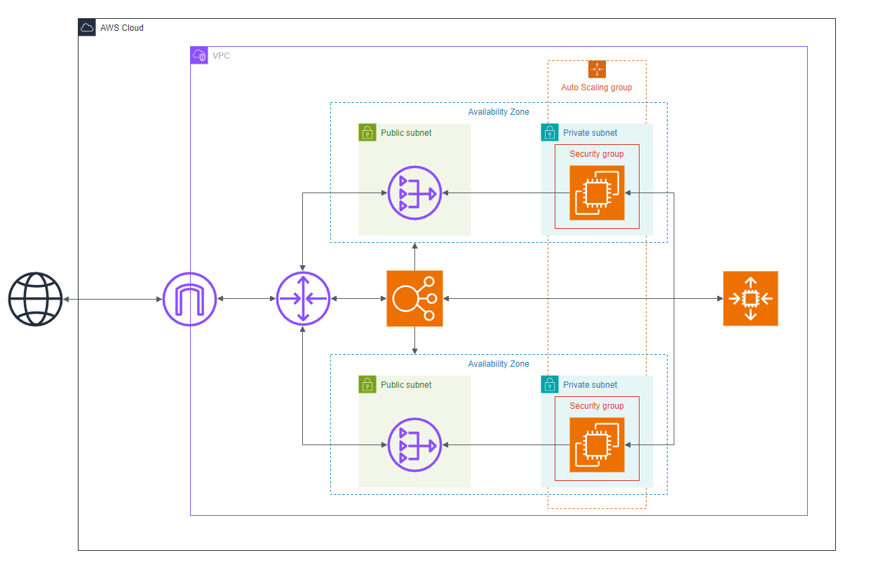

# Snake Game

## Description
This is a simple Snake Game whose HTML, CSS, & JS codes I got from this video https://www.youtube.com/watch?v=baBq5GAL0_U&t=65s. While the game is simple, my main goal is to have a hands-on practice with Cloud technologies. Specifically in this project, I:

- Deployed & hosted on AWS a highly scalable & available a snake game (using NodeJS as the backend) using EC2, ASG, & Load Balancer.
- Setup a custom VPC from scratch, where I manually setup the private & public subnets with the appropiate CIDR ranges, before associating them using Route tables.

## System Diagram
